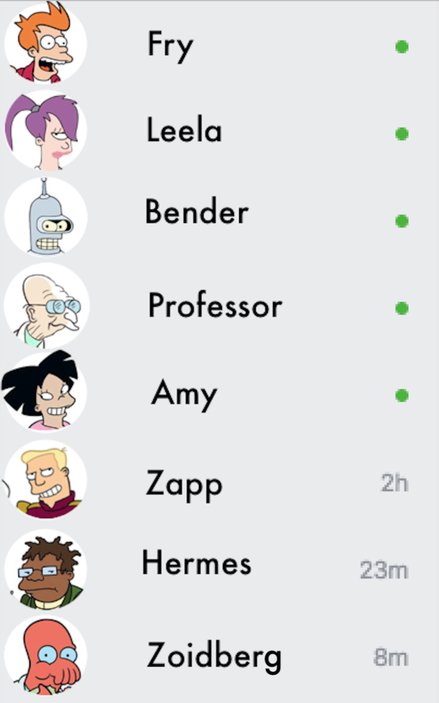

# Building a ContactsList

In this example, we have a server that provides us with an JSON array to our client app that is to display a React App Contact List. Let's say by making the request to GET https://exampleserver.com/v1/contacts/list will return the follow:


```
let contacts : [{
		"name": "Fry",
		"date_added": "2017-03-27",
		"group": "human",
		"gender": "male",
		"born" : "earth",
		"status" : "online"
	},{
		"name": "Leela",
		"date_added": "2017-03-27",
		"group": "human",
		"gender": "female",
		"born" : "earth",
		"status" : "online"
	},
...
	{
		"name": "Hermes",
		"date_added": "2017-03-27",
		"group": "human",
		"gender": "male",
		"born" : "earth",
		"status" : "offline"
	},
	{
		"name": "Zoidberg",
		"date_added": "2017-03-27",
		"group": "lobster",
		"gender": "male",
		"born" : "unknown",
		"status" : "offline"
	}]

```
Given the array above we can create a list that can look like:


As we are building this, what are some things to consider in terms of performance?

### Cost of operations

Firstly, network calls are expensive. Making an API call to another server takes signficiantly more time than making queries on your local device.

### Limit the number of operations 
Do what is only necessary. If we have a search feature for this contact list and the server also provides GET https://exampleserver.com/v1/contacts/search?q= 
Should we use this API call whenever the user types in a query into the search box.

This is the first step of thinking about performance when building apps. In the next section, we dig deeper to determine how we analyze performance when working with data structures.


So what it takes to do a search.
