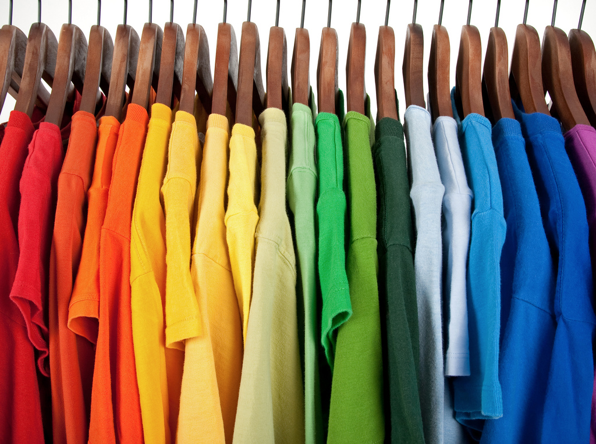

# Introduction

## Performance and Optimization

In order to talk about performance and optimization, let's first discuss some concepts that will get us closer to those topics. For instance, "sorting"; what is sorting?

### What is sorting?

Certain items, by their nature, lend themselves to being sorted. Other items have a less obvious sorting strategy.

#### For instance, Numbers? People? Sandwiches? T-Shirts?

Think about how you would approach sorting each of these collections.

### How to sort?

How would we approach taking the first closet of unsorted t-shirts and finishing with the second closet of t-shirts sorted by colour? What are the actually steps to take? Is there more than one approach?

#### Selection Sort
Scan through the t-shirts from left to right, and select the t-shirt that is next in the sort order. Remove it and move it to the group of shirts that have already been sorted, near the front of all the shirts on the far left of the closet.

#### Insertion Sort
Remove all the t-shirts from the closet and lay them on the bed. Then, one at a time, pick the next t-shirt off the bed and insert it where it belongs in the closet.

#### Divide and "Colour" (uh, I mean 'Conquer')
Break the t-shirts into smaller piles grouped by basic colour. All the the blues, the reds, the greens, blacks, grays, etc. These smaller piles are then easier to sort individually. Then you can combine the smaller piles, which are already sorted internally, into a larger collection.

In fact, there are many more ways we could approach the task of sorting these t-shirts by colour. Each of these strategies will have a particular set of pros & cons, take a relative amount of time to perform, require a particular amount of extra space to maneuver, and other considerations.

This is where our discussion about performance and optimization begins.
